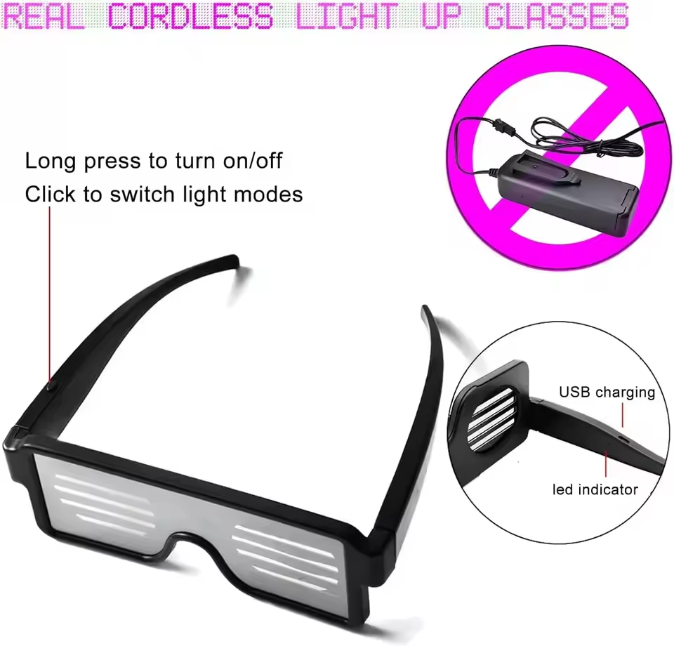
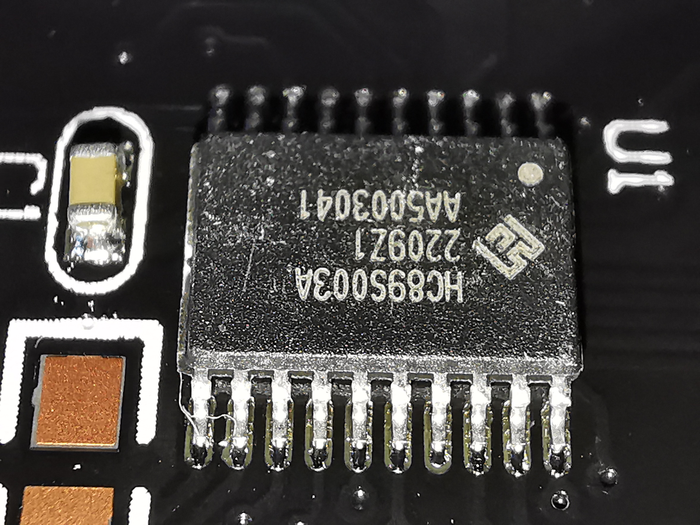
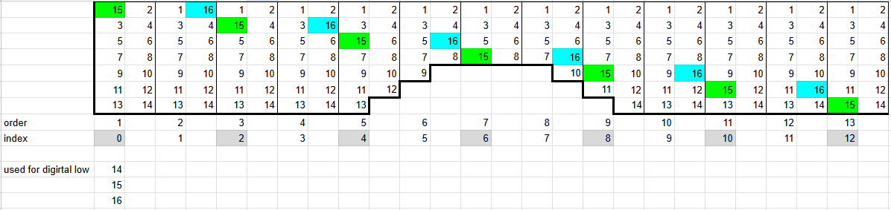

# GlassesLed26x7 - LED Glasses Matrix

Reverse-engineered **26x7 LED matrix driver** for LED glasses, allowing custom animations using a microcontroler.

## TL;DR
Want to see it in action? Check out these [examples](#2-examples).

---
**This repository contains:**
- **circuit connections**
- **example arduino code**
- reverse engineering history
- bitmap image generator 

---
## General overview
GlassesLed26x7 is circuit board used in LED Glasses like [these](https://aliexpress.com/item/33043651338.html) from Aliexpress or [these](https://aliexpress.com/item/33043651338.html).

It is a **26x7 LED matrix** designed using [**Charlieplexing**](https://en.wikipedia.org/wiki/Charlieplexing)

The design uses a HC899S003A, but I removed it and used an ESP32 for convenience.

> [!WARNING]
> You have to **drive the LEDs** with around **3.3V !!!**
> That is why I used an ESP32, what i had on hand.

---
## 1. Pin connection
I have numbered the pins in order (not the chip pin numbers or ESP pin numbers).

- **1-13** digital **high and low**
- **14-16** digital **low only**
- VCC was originally used for battery +
- BTN was originally used for button

The board includes 5 pins for flashing firmware to the original HC899S003A chip.  
If you manage to reverse-engineer it, let me know, and I'll link your work!

(If you manage to do it I can link you)

The pins connect LEDs into **13 sections of 14 LEDs**

Whenever a pin for digital low would be the same as digital high it is swapped for 15 (for odd section number) and 16 (for even section number)

## 2. Examples
Having an array of microcontroler pins `pins` we can drive the matrix iterating throuth every pin for each section and light them up occording to the bitmap image.

- [Example code](</reverse engineering/stage 3.1 - image test/image_test/image_test.ino>)
of displaying bitmap.

- [Another one](</reverse engineering/stage 3.2 - proper async image displaying/async_image/async_image.ino>) using asyncronous method.

I also built a [bitmap generator](</reverse engineering/stage 3.1 - image test/image generator.py>) for ease of development.

---
## TODO
Driving the matrix using register manipulation for longer glow time, thus brighter image.

## License
This project is licensed under the **GNU General Public License v3.0 (GPL-3.0)** - see the [LICENSE](LICENSE) file for details.
